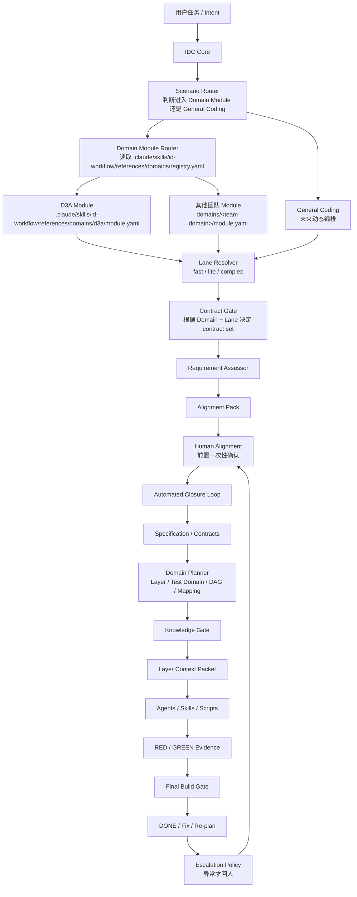
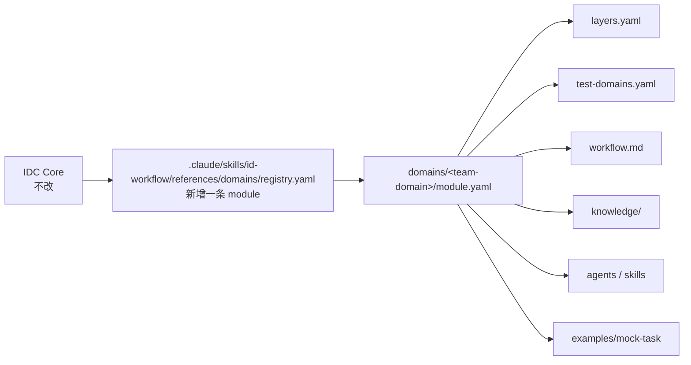

# 架构图

## 总架构


```mermaid
flowchart TD
    A["用户任务 / Intent"] --> B["IDC Core"]

    B --> C["Scenario Router<br/>判断进入 Domain Module 还是 General Coding"]
    C --> D["Domain Module Router<br/>读取 .claude/skills/id-workflow/references/domains/registry.yaml"]
    C --> G["General Coding<br/>未来动态编排"]

    D --> E["D3A Module<br/>.claude/skills/id-workflow/references/domains/d3a/module.yaml"]
    D --> F["其他团队 Module<br/>domains/&lt;team-domain&gt;/module.yaml"]

    E --> H["Lane Resolver<br/>fast / lite / complex"]
    F --> H
    G --> H

    H --> C0["Contract Gate<br/>根据 Domain + Lane 决定 contract set"]
    C0 --> I["Requirement Assessor"]
    I --> A0["Alignment Pack"]
    A0 --> A1["Human Alignment<br/>前置一次性确认"]
    A1 --> J["Automated Closure Loop"]
    J --> K["Specification / Contracts"]
    K --> L["Domain Planner<br/>Layer / Test Domain / DAG / Mapping"]
    L --> M["Knowledge Gate"]
    M --> N["Layer Context Packet"]
    N --> O["Agents / Skills / Scripts"]
    O --> P["RED / GREEN Evidence"]
    P --> Q["Final Build Gate"]
    Q --> R["DONE / Fix / Re-plan"]
    R --> S["Escalation Policy<br/>异常才回人"]
    S --> A1
```

## D3A 作为一个 Module


```mermaid
flowchart TD
    A[".claude/skills/id-workflow/references/domains/d3a/module.yaml"] --> B["Route<br/>D3A_CODING"]
    A --> C["Registries"]
    A --> D["Workflow"]
    A --> E["Knowledge"]
    A --> F["Execution"]
    A --> G["Examples"]

    C --> C1[".claude/skills/id-workflow/references/registries/d3a-layers.yaml<br/>TRAN_CFG / DO / VISP_ADP / TFC_TFI / TFE / ADP / DRV"]
    C --> C2[".claude/skills/id-workflow/references/registries/dt-domains.yaml<br/>TPRINT / FW / DPF"]

    D --> D1[".claude/skills/id-workflow/references/workflows/d3a-workflow.md"]
    D --> D2["schemas/d3a-plan.schema.yaml"]
    D --> D3["workflows/tdd-state-machine.md"]

    E --> E1[".claude/skills/id-workflow/references/knowledge/d3a/layers/"]
    E --> E2[".claude/skills/id-workflow/references/knowledge/d3a/dt/"]

    F --> F1[".claude/agents/d3a-layer-coder.md"]
    F --> F2[".claude/agents/dt-test-writer.md"]
    F --> F3[".claude/agents/build-error-analyzer.md"]
    F --> F4[".claude/skills/d3a-coding/"]
    F --> F5[".claude/skills/dt-build/"]
    F --> F6[".claude/skills/tran-build/"]

    G --> G1["examples/mock-d3a-task/"]
```

## 其他团队复制方式


```mermaid
flowchart LR
    A["IDC Core<br/>不改"] --> B[".claude/skills/id-workflow/references/domains/registry.yaml<br/>新增一条 module"]
    B --> C["domains/&lt;team-domain&gt;/module.yaml"]
    C --> D["layers.yaml"]
    C --> E["test-domains.yaml"]
    C --> F["workflow.md"]
    C --> G["knowledge/"]
    C --> H["agents / skills"]
    C --> I["examples/mock-task"]
```

核心原则：

```text
复制 IDC Core
  -> 新增 Domain Module
  -> 填自己的 Layer / Test Domain / Knowledge / Build Gate
  -> 不改 D3A
  -> 不改 Core
```
