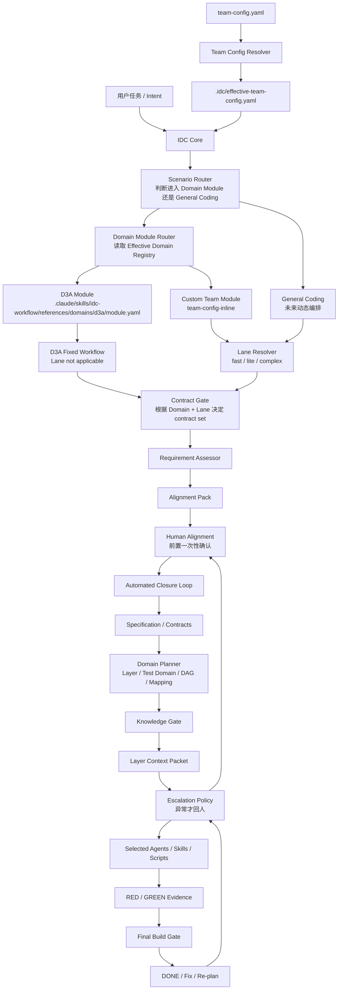
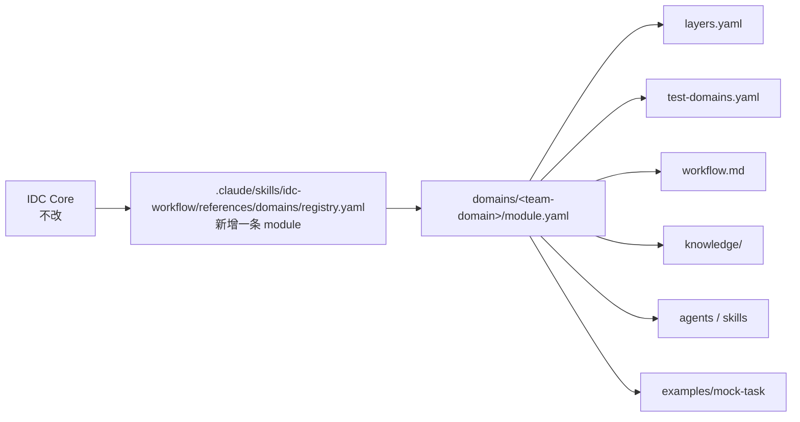

# 架构说明

Intent Dynamic Code 把稳定的工作流机制和私有配置的企业 domain binding 分开。

一句话：

```text
外部做通用 harness，接入团队后填真实企业知识。
```

## 总体分层

```text
Scenario Router
  -> Domain Module Router
  -> Module Lane applicability policy
  -> Lane Resolver when applicable
  -> Contract Gate
  -> Dynamic Scenario Workflow
  -> D3A Module
  -> Other Team Domain Module
  -> General Coding Fallback
  -> Skill Adapter Router

Engineering Control
  -> Requirement Assessor
  -> Specification
  -> API Contract
  -> TDD State Machine
  -> Verification Gates

Knowledge System
  -> Static Domain Knowledge
  -> Dynamic Repository Context

Execution Runtime
  -> Claude Code / Codex / other coding runtime
  -> Agents / Subagents / Skills / Scripts
```

## 顶层思路

整个系统不是一个单一 Agent，而是一套动态分流的 Intent-Driven Coding 框架：

```text
用户 Intent
  -> Discovery
  -> Intake / normalize inside Discovery
  -> Human Alignment Check
  -> Discovery Trigger Flow / Clarification Trigger Flow
  -> 场景识别
  -> readiness / critical gap / approval validity 检测
  -> 选择 Dynamic Scenario / Domain Module / General Coding fallback
  -> 应用 Domain Module 固定 Lane，或动态选择执行强度 Lane
  -> 根据 Domain + Lane 决定 contract set
  -> 前置 Human Alignment
  -> 动态工作流 / domain planning
  -> 知识加载
  -> subagent 执行
  -> TDD / build verification
```

整体用户输入分流图和 Discovery Trigger Flow 见：

```text
docs/user-input-routing-overview.html
docs/intake-discovery-trigger-flow.html
```

## 可插拔 Domain Module

IDC Core 不直接绑定 D3A。它只认识 Domain Module Contract。

```text
IDC Core
  -> .idc/effective-team-config.yaml
  -> built-in domain module or team-config-inline custom module
  -> module.workflow.entrypoint
```

一个 Domain Module 至少定义：

- route id。
- required contracts。
- coding layer registry。
- test domain registry。
- workflow entrypoint。
- planner schema。
- knowledge root。
- agents / skills。
- completion gate。
- Lane applicability policy（dynamic、fixed 或 not_applicable）。

D3A 是当前第一个 active module：

```text
.claude/skills/idc-workflow/references/domains/d3a/module.yaml
```

D3A module 的 `lane_policy` 为 `not_applicable`，因此路由命中 D3A 后不再
调用通用 Lane Resolver，而由 `d3a_fixed_workflow` 接管。

其他团队接入时填写：

```text
team-config.yaml.domain.custom
```

Resolver 自动注册为有效 Domain Module，不编辑共享 registry。

## Input Adapter

用户输入可以是一句话，也可以是 TR3 设计文档。

Input Adapter 负责把不同输入形态统一成：

```text
normalized_request
```

TR3 输入会额外抽取：

- 开发需求描述。
- API / 行为语义。
- DT 设计。
- 验收标准。
- 影响范围。
- domain candidates。
- change type。
- change shape。
- lane signals。

TR3 可以帮助判断新增需求、霰弹式修改和 D3A 需求，但 TR3 不是 completion evidence。

## Lane Resolver

Lane 只表示执行强度，不表示领域。

Lane applicability 有三种策略：

- Dynamic Scenario、General Coding 和 `dynamic` Domain Module 使用 Lane Resolver。
- `fixed` 为确实需要固定 Lane 的团队 Domain Module 保留。
- `not_applicable` 不输出 Lane，由 Domain workflow 接管；D3A 使用此策略。

v1.0 只有三种 Lane，且只允许这三种输出：

```text
fast
lite
complex
```

不设置 `known-domain`、`d3a`、`gc`、`dynamic` 或 `unknown` lane。
这些概念分别由 Domain Module Router、Scenario Router 或 Skill Adapter Router 表达。

判断规则：

- 命中 Complex hard trigger，直接进入 `complex`。
- 只有 Fast required conditions 全部满足，才允许 `fast`。
- 其他情况默认 `lite`。

Lane 被选中后，团队可通过 `team-config.yaml.lane.profiles.<lane>` 定义不同的
Skill allow/deny/required 集合与 stage 编排。`autonomous` 允许 Selector 在团队
步骤之外补齐最小充分集合；`ordered` 只执行当前 stage 的配置步骤，缺少映射时
返回 `NEEDS_ORCHESTRATION_MAPPING`。这些字段由 Resolver 校验并进入 effective
config，不是描述性偏好。

这样可以避免只靠模型主观判断复杂度。

## Contract Gate

Contract Gate 根据 `Domain Module + Lane + Task Type` 决定需要哪些 contract。

API Contract 不是全局强制项。

例如：

- Fast 文档类任务：Task Summary + Acceptance Criteria。
- Lite 通用开发：Task Contract + Focused Verification。
- Complex 通用开发：Task Contract + Detailed Plan + Verification Contract。
- D3A Module：D3A Specification + API Contract + Task Contract + Verification Contract。

## Skill Adapter Router

Skill Adapter Router 不靠名字猜测是否使用 GC / DT / Superpowers。

Capability Selector 先读取：

```text
.idc/effective-team-config.yaml.available_capabilities
registries/team-capabilities.yaml
Lane capability profile or D3A execution profile
team-config lane Skill policy and orchestration steps
```

它先应用 Lane 的 allow/deny/required 与编排步骤，再根据 capability demand、
stage、signals 和 contracts 补齐最小充分集合，并输出 execution order 以及
selected / skipped reasons。Skill Adapter Router 随后只执行已选中的绑定。

如果没有 registry row 匹配，返回 `NEEDS_ADAPTER_MAPPING`，不能临时把某个
`idc-gc-*` 或 `idc-dt-*` skill 当作万能入口。

## Execution Authorization

Capability Selection 只决定“哪些能力应当执行”，不直接授予 main agent 修改仓库
的权限。Planner 必须先创建 Delegation Contract，再通过 Execution Authorization
Gate 并真实派发 subagent / agent team / dynamic workflow。

General Domain 的层级固定为：

```text
idc-general-coding             = 外层 Domain execution protocol
idc-gc-sop-adapter / GC atoms = executor 内部按需使用的原子能力
general-coder / coding team    = repository mutation owner
main agent                     = planner / delegator / evidence summarizer
```

任何 Lane 的 repository mutation 都必须返回 Execution Receipt，包含 authorization
ID、dispatch tool-call ref、executor session ref 和 loaded Domain execution Skill。
缺少 provenance 时，即使测试通过也不能 DONE。

## Human Alignment

Human Alignment 是唯一默认人工对齐点，也是 readiness / critical gap / approval validity 的统一检测 gate。

设计哲学：

```text
前置对齐
后置自动闭环
异常再回人
```

Human Alignment 发生在 Planner 之前。Discovery 只提供 normalized request、input type、maturity signal 和已知未知项；是否能进入 approval / execution 由 Human Alignment Check 决定。

它检测：

- 是否需要 Brainstorming 继续发散。
- 是否存在 contract / scope / completion gate / API semantics / test evidence / file placement gap。
- 是否需要 Grill With Docs 同步公开决策记录。
- 是否可以生成 Alignment View。
- 已有 approval ref / checkpoint 是否仍有效。
- 是否发生 scope drift，需要 Re-alignment。

它让人确认：

- 输入理解。
- Domain / Lane 判断。
- change type / change shape。
- contract set。
- scope / boundary。
- completion gate。
- open questions。

它不确认具体实现细节。

如果信息不足，先进入 Grill Me / Clarification，补齐后再生成 Alignment Pack。

## Automated Closure Loop

Human Alignment approve 后，后续默认自动闭环：

```text
Planner
  -> Knowledge Preparation
  -> Execution Unit Split
  -> TDD Execution
  -> Verification
  -> Error Analyzer / Targeted Fix / Re-plan
  -> DONE
```

General Coding 与 D3A 都使用这条骨架。General 由 Lane 动态调节执行强度；
D3A 不使用 Lane，而由企业固定 SOP 约束 Planner 可选 Layer、逐 Layer knowledge、
DT mapping、TDD 状态机和 completion gate。

后续不再默认人工卡点。

只有命中 Escalation Policy 才回到 Human Alignment：

- 需要扩大 scope。
- 需要修改 API Contract。
- Planner 无法在 scope 内完成。
- 工具 evidence 缺失。
- 连续自动修复失败。
- Domain / Lane 需要重判。
- TR3 和 repo facts 冲突。
- Completion gate 无法满足。

## D3A Module

D3A 场景的主流程是 harness 固定的流程。IDC 只能判断输入是否满足进入条件，并在固定流程内部做 layer、DT domain、execution unit、adapter 和 evidence 的动态选择；不能重排或重新设计 D3A 主流程。

D3A 使用固定架构空间，但在这个固定空间内动态规划。

固定 Coding Layer：

```text
TRAN_CFG
DO
VISP_ADP
TFC_TFI
TFE
ADP
DRV
```

默认 DT Domain placeholder：

```text
TPRINT
FW
DPF
```

D3A 的动态性主要发生在：

- 本次任务涉及哪些 Coding Layer。
- 本次需要哪些 DT Domain。
- Layer 之间的 dependency DAG 怎么排。
- Coding Layer 和 DT Domain 如何形成 verification mapping。
- 哪些知识需要加载。
- 哪些 subagent 可以并行，哪些必须串行。

重要约束：

- D3A 主流程顺序固定。
- D3A Planner 不能创建新的 D3A Layer。
- D3A Planner 不能删除已有 D3A Layer。
- Coding Layer 到 DT Domain 是多对多关系，不能在外部环境猜。
- 所有真实 mapping 必须接入团队配置后填写。
- API Contract 必须先于 implementation。
- RED evidence 必须先于 GREEN evidence。
- DONE 必须同时满足 required DT GREEN 和 `tran_build PASS`。

## Dynamic Scenario Mode

Dynamic Scenario 用于没有固定 Domain Module、但仍需要按任务形态动态编排的场景。

它可以根据：

- 复杂度。
- 不确定性。
- 风险。
- 可测试性。
- 是否需要 GC SOP atomic ability。
- 是否需要 subagent / agent team / official dynamic workflow。

决定后续执行方式。

它不允许猜测 D3A Layer、DT Domain 或企业内部 GC SOP 细节。

## General Coding Fallback

General Coding 用于简单普通开发任务 fallback。

更复杂的非 D3A 任务优先进入 Dynamic Scenario Mode。

v1.0 只预留 assessment 维度：

- Complexity
- Uncertainty
- Risk
- Testability

未来 composer 可以根据这些维度决定：

- 是否需要 Grill Me。
- Specification 深度。
- TDD 深度。
- Context gathering 策略。
- Subagent 拆分策略。
- Review 和 final verification 强度。

## 四个关键角色

```text
Scenario Router
  -> 判断进入 Domain Module 还是 General Coding

Domain Module Router
  -> 判断选中哪个可插拔 module

Requirement Assessor
  -> 作为 Human Alignment Check 的被动检查表，判断需求信息够不够

Domain / Dynamic Planner
  -> 判断这条路具体怎么走
```

Requirement Assessor 只负责检查结论，不负责澄清、设计、规划、approval 或写代码；是否触发 Grill Me、Grill With Docs、Re-alignment 或 execution 放行，由 Human Alignment Gate 决定。

## 知识系统

Knowledge 分两类：

```text
Static Domain Knowledge
  -> Layer Knowledge
  -> DT Knowledge
  -> Architecture Rules

Dynamic Repository Context
  -> Grep
  -> CodeGraph
  -> Wiki
  -> Repository Search
```

v1.0 只定义接口和模板，不接真实企业 CodeGraph / Wiki。

## 团队配置边界

外部可以开发：

- 工作流状态机。
- Schema shape。
- Agent 职责边界。
- Mock examples。
- Placeholder skill 接口。
- Harness tests。

必须接入团队配置开发：

- 真实 Domain Module 知识。
- 真实 D3A Layer / DT Domain 知识。
- 真实 build / run 命令。
- 真实 repo context provider。
- 真实 build error 到 Layer 的归因规则。

## 架构图

### 总架构



### D3A 作为一个 Module

```mermaid
flowchart TD
    A[".claude/skills/idc-workflow/references/domains/d3a/module.yaml"] --> B["Route<br/>D3A_CODING"]
    A --> C["Registries"]
    A --> D["Workflow"]
    A --> E["Knowledge"]
    A --> F["Execution"]
    A --> G["Examples"]
    A --> H["Lane Policy<br/>not applicable / bypass resolver"]

    C --> C1[".claude/skills/idc-workflow/references/registries/d3a-layers.yaml<br/>TRAN_CFG / DO / VISP_ADP / TFC_TFI / TFE / ADP / DRV"]
    C --> C2[".claude/skills/idc-workflow/references/registries/dt-domains.yaml<br/>TPRINT / FW / DPF"]

    D --> D1[".claude/skills/idc-workflow/references/workflows/d3a-workflow.md"]
    D --> D2["schemas/d3a-plan.schema.yaml"]
    D --> D3["workflows/tdd-state-machine.md"]

    E --> E1[".claude/skills/idc-workflow/references/knowledge/d3a/layers/"]
    E --> E2[".claude/skills/idc-workflow/references/knowledge/d3a/dt/"]

    F --> F1[".claude/agents/d3a-layer-coder.md"]
    F --> F2[".claude/agents/dt-test-writer.md"]
    F --> F3[".claude/agents/build-error-analyzer.md"]
    F --> F4[".claude/skills/idc-d3a-coding/"]
    F --> F5[".claude/skills/idc-dt-build/"]
    F --> F6[".claude/skills/idc-tran-build/"]

    G --> G1["examples/mock-d3a-task/"]
```



### 其他团队复制方式



## 命名约定

本项目采用"中文说明 + 稳定英文标识"：人看的解释用中文；被脚本、agent、
schema 稳定读取的内容保持英文，避免字段不一致、测试失效或跨工具传递失败。

保持英文的四类内容：

- 文件 / 目录名（`docs/`、`schemas/`、`.claude/skills/` 等）。
- YAML / Python 字段名（`api_contract`、`required_dt_domains` 等机器接口 key）。
- 固定架构标识（`TRAN_CFG`…`DRV`、`TPRINT` / `FW` / `DPF` registry id）。
- 状态与 evidence 枚举（`RED` / `GREEN` / `PASS` / `DONE` 等 gate 使用的值）。

要改 contract 或测试时再看 `schemas/` 与 `tests/test_harness.py`；只理解
项目看本文档与 `docs/confidential-migration-checklist.md` 即可。
